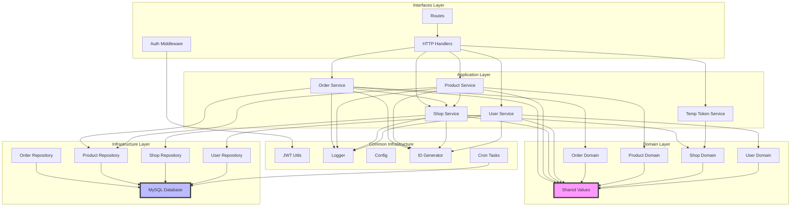
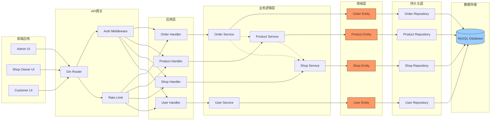

# OrderEase-Golang 业务逻辑深度分析报告

## 一、项目概览

### 1.1 技术栈识别

**后端技术栈：**
- **Web框架**：Gin 1.9.1 (轻量级HTTP路由框架)
- **ORM**：GORM 1.25.7 (对象关系映射)
- **数据库**：MySQL 8.0+ (关系型数据库)
- **认证授权**：JWT 4.5.1 (JSON Web Token)
- **密码加密**：bcrypt (密码哈希)
- **日志系统**：Zap 1.27.0 + Lumberjack 2.2.1 (结构化日志+日志轮转)
- **配置管理**：Viper 1.19.0 (多格式配置加载)
- **ID生成**：Snowflake 0.3.0 (分布式唯一ID)
- **定时任务**：Cron v3.0.1 (定时任务调度)
- **API文档**：Swaggo 1.16.3 (Swagger自动文档生成)
- **数据序列化**：GORM datatypes 1.0.5 (JSON类型支持)

**核心设计模式：**
- 领域驱动设计（DDD）架构
- 四层架构：Domain → Application → Infrastructure → Interfaces

### 1.2 项目结构概览

```
src/
├── domain/                    # 领域层（核心业务逻辑）
│   ├── order/                # 订单领域
│   │   ├── order.go         # 订单实体、值对象、业务规则
│   │   └── repository.go    # 仓储接口定义
│   ├── product/              # 商品领域
│   ├── shop/                 # 店铺领域
│   ├── user/                 # 用户领域
│   └── shared/               # 共享值对象（ID, Price等）
├── application/              # 应用层（服务编排）
│   ├── services/            # 应用服务
│   │   ├── order_service.go
│   │   ├── product_service.go
│   │   ├── shop_service.go
│   │   └── user_service.go
│   └── dto/                 # 数据传输对象
├── infrastructure/           # 基础设施层（技术实现）
│   ├── persistence/         # 持久化转换器
│   └── repositories/        # 仓储实现（GORM）
├── interfaces/              # 接口层（对外接口）
│   ├── http/                # HTTP处理器
│   └── middleware/          # 中间件
├── routes/                  # 路由配置
│   ├── backend/             # 后台管理路由
│   │   ├── shop_owner_routes.go  # 商家路由（70+接口）
│   │   ├── admin_user_routes.go  # 管理员路由
│   │   └── no_auth_routes.go     # 免认证路由
│   └── frontend/            # 前台用户路由
├── handlers/                # 旧版处理器（兼容层）
├── models/                  # 数据模型（GORM实体）
├── middleware/             # 认证中间件
├── utils/                  # 工具类（JWT、密码、加密等）
└── tasks/                  # 定时任务（令牌清理等）
```

---

## 二、核心业务模块清单

### 模块一：订单交易流水线（Order Management Pipeline）

**核心职责**：管理订单全生命周期，包括订单创建、状态流转、查询统计和删除，是系统的交易核心。

**关键代码位置**：
- 领域实体：`src/domain/order/order.go`
- 应用服务：`src/application/services/order_service.go`（460行）
- HTTP处理器：`src/interfaces/http/order_handler.go`（8.5KB）
- 数据模型：`src/models/order.go`
- 路由定义：`src/routes/backend/shop_owner_routes.go` (151-254行)

**关键实体/模型**：
- `Order` - 订单主实体，包含用户ID、店铺ID、总价、状态、备注等
- `OrderItem` - 订单项，记录商品快照信息（名称、描述、图片、价格）
- `OrderItemOption` - 订单项选项，记录商品参数快照（类别名、选项名、价格调整）
- `OrderStatusLog` - 订单状态变更日志，追踪所有状态流转历史
- `OrderStatusFlow` - 订单流转配置，支持每个店铺自定义状态机

**核心业务逻辑**：
1. **订单创建**：验证商品库存、校验商品归属店铺、扣减库存、计算总价、生成订单快照
2. **状态流转**：基于状态机进行状态转换（待处理→已接单→已完成/已取消）
3. **订单查询**：支持按店铺、用户、状态、时间范围等多维度查询
4. **未完成订单**：查询所有非终态订单（待处理、已接单等）
5. **高级搜索**：支持多条件组合搜索订单

---

### 模块二：商品与参数管理（Product & Option Management）

**核心职责**：管理商品目录、商品参数配置、标签分类，支持商品上架/下架/删除操作。

**关键代码位置**：
- 领域实体：`src/domain/product/product.go`
- 应用服务：`src/application/services/product_service.go`（356行）
- HTTP处理器：`src/interfaces/http/product_handler.go`（5.85KB）
- 数据模型：`src/models/product.go`, `src/models/product_option.go`
- 路由定义：`src/routes/backend/shop_owner_routes.go` (62-148行)

**关键实体/模型**：
- `Product` - 商品实体，包含基本信息、库存、状态、图片
- `ProductOptionCategory` - 商品参数类别（如：尺寸、颜色、配料）
- `ProductOption` - 商品参数选项（如：大杯、加珍珠、少糖）
- `ProductTag` - 商品标签关联表

**核心业务逻辑**：
1. **商品CRUD**：创建、查询、更新、删除商品
2. **参数配置**：支持多类别、多选项的灵活参数配置（必填/多选/默认值）
3. **状态管理**：pending → online → offline 状态流转
4. **库存管理**：库存增加/减少/校验
5. **图片上传**：图片上传、压缩、自动删除旧图
6. **删除保护**：有关联订单的商品不能删除，只能下架

---

### 模块三：店铺运营中心（Shop Operations Center）

**核心职责**：管理店铺信息、店主认证、有效期管理、订单状态流转配置，是系统的租户隔离基础。

**关键代码位置**：
- 领域实体：`src/domain/shop/shop.go`
- 应用服务：`src/application/services/shop_service.go`（6.5KB）
- HTTP处理器：`src/interfaces/http/shop_handler.go`（4.69KB）
- 数据模型：`src/models/shop.go`
- 路由定义：`src/routes/backend/shop_owner_routes.go` (403-454行)

**关键实体/模型**：
- `Shop` - 店铺实体，包含店主账号、联系方式、有效期、订单流转配置
- `Tag` - 店铺标签（用于商品分类）
- `OrderStatusFlow` - 订单流转状态配置（JSON类型）

**核心业务逻辑**：
1. **店铺管理**：创建、查询、更新店铺信息
2. **店主认证**：用户名密码登录、密码修改
3. **有效期管理**：店铺到期检测、剩余天数计算
4. **订单流转配置**：自定义订单状态机（待处理→已接单→完成/取消）
5. **临时令牌**：生成6位临时令牌用于免密登录（定时刷新）
6. **标签管理**：标签创建、商品打标签

---

### 模块四：用户身份与权限中心（User Identity & Authorization）

**核心职责**：用户认证、JWT令牌管理、权限控制（管理员/商家/前端用户），是系统的安全基础。

**关键代码位置**：
- 领域实体：`src/domain/user/user.go`
- 应用服务：`src/application/services/user_service.go`（2.53KB）
- HTTP处理器：`src/handlers/auth.go`（12.91KB）
- 中间件：`src/middleware/auth.go`，`src/interfaces/middleware/auth.go`
- 数据模型：`src/models/user.go`, `src/models/admin.go`, `src/models/token.go`

**关键实体/模型**：
- `User` - 用户实体，支持私有用户/公开用户角色
- `Admin` - 管理员实体（系统级超级管理员）
- `Shop` - 店主实体（通过Shop表管理）
- `JWT Claims` - JWT令牌载荷
- `BlacklistedToken` - 令牌黑名单

**核心业务逻辑**：
1. **统一登录**：管理员和商家共用登录接口（根据用户名识别）
2. **JWT认证**：生成JWT令牌、解析令牌、验证令牌
3. **令牌刷新**：刷新令牌接口
4. **令牌黑名单**：登出时将令牌加入黑名单
5. **权限中间件**：
   - `BackendAuthMiddleware` - 后台商家/管理员认证
   - `FrontendAuthMiddleware` - 前台用户认证
   - `AdminMiddleware` - 管理员权限验证
6. **密码管理**：密码加密、密码校验、密码修改

---

### 模块五：标签分类系统（Tag Classification System）

**核心职责**：店铺标签管理、商品标签关联、标签查询，用于商品分类和推荐。

**关键代码位置**：
- 领域实体：`src/domain/shop/tag.go`
- 应用服务：`src/application/services/shop_service.go`
- HTTP处理器：`src/handlers/tag.go`（27.52KB）
- 数据模型：`src/models/tag.go`
- 路由定义：`src/routes/backend/shop_owner_routes.go` (257-401行)

**关键实体/模型**：
- `Tag` - 标签实体，名称、颜色、排序
- `ProductTag` - 商品标签关联表

**核心业务逻辑**：
1. **标签CRUD**：创建、查询、更新、删除标签
2. **商品打标签**：单个打标签、批量打标签
3. **标签查询**：查询商品已绑定标签、查询商品未绑定标签
4. **标签关联查询**：查询标签关联的商品、查询商品关联的标签
5. **未使用标签查询**：查询没有绑定商品的标签

---

### 模块六：公共基础设施（Common Infrastructure）

**核心职责**：提供系统级服务，包括日志、配置、ID生成、文件上传、定时清理等，是所有模块的依赖基础。

**关键代码位置**：
- 日志工具：`src/utils/log2/`
- 配置管理：`src/config/config.go`
- ID生成：`src/utils/snowflake_utils.go`
- JWT工具：`src/utils/jwt.go`
- 密码工具：`src/utils/password.go`
- 定时任务：`src/tasks/cleanup.go`，`src/tasks/cleanup_tokens.go`
- 临时令牌：`src/services/temp_token.go`

**核心功能**：
1. **ID生成**：Snowflake分布式ID生成
2. **密码加密**：bcrypt密码哈希
3. **JWT认证**：令牌生成、解析、验证
4. **日志管理**：结构化日志、日志轮转
5. **文件上传**：图片上传、压缩、删除
6. **定时清理**：过期令牌清理、临时令牌刷新

---

## 三、模块依赖关系详述

### 3.1 单向依赖关系

| 依赖方 | 被依赖方 | 依赖说明 |
|--------|----------|----------|
| **订单模块** | 用户模块 | 订单创建需要验证用户存在、查询用户信息 |
| **订单模块** | 商品模块 | 订单创建需要校验商品库存、获取商品价格、扣减库存 |
| **订单模块** | 店铺模块 | 订单关联店铺ID、使用店铺的订单流转配置 |
| **商品模块** | 店铺模块 | 商品必须属于某个店铺（ShopID外键） |
| **标签模块** | 店铺模块 | 标签必须属于某个店铺（ShopID外键） |
| **临时令牌** | 店铺模块 | 临时令牌用于店铺免密登录 |
| **所有模块** | 公共基础设施 | ID生成、日志、配置、JWT等基础服务 |

### 3.2 相互依赖关系

**无明显相互依赖**：各业务模块之间主要是单向依赖，没有循环依赖。

**服务层依赖**：
- `OrderService` 依赖 `ProductRepository`、`ShopService`（通过接口）
- `ProductService` 依赖 `ProductRepository`、`ShopService`
- `ShopService` 依赖 `ShopRepository`、`TagRepository`
- `UserService` 依赖 `UserRepository`

### 3.3 核心共享模块

**domain/shared（共享值对象）**：
- `shared.ID` - 统一ID类型（基于Snowflake）
- `shared.Price` - 价格值对象（封装价格计算逻辑）

**application/dto（数据传输对象）**：
- 所有模块的Request/Response DTO定义
- 数据转换规则

**models（数据模型层）**：
- GORM实体定义
- 数据库表结构映射

### 3.4 数据流与API调用

**关键业务流程：订单创建流程**

```
前端客户端 → HTTP Handler → OrderService
                           ↓
                       ProductService (验证商品、扣库存)
                           ↓
                       ShopService (获取店铺配置)
                           ↓
                       MySQL数据库 (事务提交)
                           ↓
                    返回订单创建响应
```

**关键业务流程：订单状态流转**

```
前端客户端 → HTTP Handler → OrderService
                           ↓
                       获取订单信息
                           ↓
                       获取店铺流转配置
                           ↓
                       校验状态转换是否合法
                           ↓
                       更新订单状态
                           ↓
                       记录状态变更日志
                           ↓
                    返回状态流转响应
```

**API接口分类统计**：

| API分组 | 接口数量 | 权限要求 | 功能说明 |
|---------|----------|----------|----------|
| **认证相关** | 4 | 无需认证 | 登录、令牌刷新 |
| **商家基础** | 2 | 商家认证 | 登出、修改密码 |
| **商品管理** | 9 | 商家认证 | CRUD、状态切换、图片上传 |
| **订单管理** | 11 | 商家认证 | CRUD、状态流转、高级搜索、SSE推送 |
| **标签管理** | 15 | 商家认证 | 标签CRUD、商品打标签、标签关联查询 |
| **店铺管理** | 4 | 商家认证 | 店铺信息、图片、流转配置、临时令牌 |
| **用户管理** | 6 | 商家认证 | 用户CRUD、简单列表 |
| **公开接口** | 8 | 无需认证 | 店铺/商品/订单查询（前台） |
| **管理员接口** | 3 | 管理员认证 | 数据查看 |

---

## 四、架构总结与可视化建议

### 4.1 架构总结

**架构类型**：**领域驱动设计（DDD）的四层架构** + **模块化单体应用**

**架构特点**：
1. **清晰的分层**：Domain → Application → Infrastructure → Interfaces 四层结构
2. **领域模型核心**：业务逻辑集中在Domain层，通过值对象和实体封装业务规则
3. **仓储模式**：通过Repository接口隔离领域层和持久化层
4. **依赖倒置**：高层模块不依赖低层模块，都依赖抽象（接口）
5. **租户隔离**：基于ShopID的多租户设计，每个店铺数据隔离
6. **状态机设计**：订单状态流转采用可配置的状态机模式

**模块耦合度评价**：
- **整体耦合度**：**中等偏低**
  - 业务模块间通过领域模型和应用服务交互
  - 避免了跨模块的数据库查询（通过仓储接口隔离）
  - 没有循环依赖
- **基础设施耦合度**：**高**
  - 所有模块都依赖公共基础设施（日志、配置、JWT等）
  - 这是合理的技术栈统一
- **数据库耦合度**：**中等**
  - 使用GORM作为统一ORM，数据库操作集中在Infrastructure层
  - 通过Converter模式隔离Domain模型和DB模型

**优点**：
1. ✅ 领域模型清晰，业务逻辑封装良好
2. ✅ 代码结构规范，易于维护和扩展
3. ✅ 支持多租户，每个店铺数据隔离
4. ✅ 订单状态流转灵活，支持自定义
5. ✅ 完善的认证授权机制

**改进建议**：
1. ⚠️ handlers目录和interfaces/http目录存在重复，建议统一
2. ⚠️ models目录和domain目录存在功能重叠，建议逐步迁移
3. ⚠️ 缺少统一错误处理和响应封装
4. ⚠️ 缺少API版本控制
5. ⚠️ 缺少单元测试和集成测试

### 4.2 模块依赖关系图



### 4.3 数据流架构图



---

## 五、附录：API接口清单

### 5.1 认证相关接口

| 方法 | 路径 | 权限 | 说明 |
|------|------|------|------|
| POST | /api/login | 无需认证 | 管理员/商家统一登录 |
| POST | /api/admin/refresh-token | 无需认证 | 刷新管理员令牌 |
| POST | /api/shop/refresh-token | 无需认证 | 刷新商家令牌 |
| POST | /api/shopOwner/logout | 商家认证 | 商家登出 |

### 5.2 商品管理接口

| 方法 | 路径 | 权限 | 说明 |
|------|------|------|------|
| POST | /api/shopOwner/product/create | 商家认证 | 创建商品 |
| GET | /api/shopOwner/product/list | 商家认证 | 获取商品列表 |
| GET | /api/shopOwner/product/detail | 商家认证 | 获取商品详情 |
| PUT | /api/shopOwner/product/update | 商家认证 | 更新商品 |
| DELETE | /api/shopOwner/product/delete | 商家认证 | 删除商品 |
| POST | /api/shopOwner/product/upload-image | 商家认证 | 上传商品图片 |
| PUT | /api/shopOwner/product/toggle-status | 商家认证 | 切换商品状态 |
| GET | /api/shopOwner/product/image | 商家认证 | 获取商品图片 |
| GET | /api/no-auth/product/list | 无需认证 | 公开商品列表 |
| GET | /api/no-auth/product/detail | 无需认证 | 公开商品详情 |

### 5.3 订单管理接口

| 方法 | 路径 | 权限 | 说明 |
|------|------|------|------|
| POST | /api/shopOwner/order/create | 商家认证 | 创建订单 |
| GET | /api/shopOwner/order/list | 商家认证 | 获取订单列表 |
| GET | /api/shopOwner/order/detail | 商家认证 | 获取订单详情 |
| PUT | /api/shopOwner/order/update | 商家认证 | 更新订单 |
| DELETE | /api/shopOwner/order/delete | 商家认证 | 删除订单 |
| PUT | /api/shopOwner/order/toggle-status | 商家认证 | 切换订单状态 |
| GET | /api/shopOwner/order/status-flow | 商家认证 | 获取订单状态流转 |
| GET | /api/shopOwner/order/unfinished-list | 商家认证 | 获取未完成订单 |
| GET | /api/shopOwner/order/sse | 商家认证 | SSE实时推送 |
| POST | /api/shopOwner/order/advance-search | 商家认证 | 高级搜索订单 |
| POST | /api/shopOwner/order/search | 商家认证 | 搜索订单 |
| GET | /api/no-auth/order/list | 无需认证 | 公开订单列表 |
| GET | /api/no-auth/order/detail | 无需认证 | 公开订单详情 |

### 5.4 标签管理接口

| 方法 | 路径 | 权限 | 说明 |
|------|------|------|------|
| POST | /api/shopOwner/tag/create | 商家认证 | 创建标签 |
| GET | /api/shopOwner/tag/list | 商家认证 | 获取标签列表 |
| GET | /api/shopOwner/tag/detail | 商家认证 | 获取标签详情 |
| PUT | /api/shopOwner/tag/update | 商家认证 | 更新标签 |
| DELETE | /api/shopOwner/tag/delete | 商家认证 | 删除标签 |
| POST | /api/shopOwner/tag/batch-tag | 商家认证 | 批量打标签 |
| GET | /api/shopOwner/tag/online-products | 商家认证 | 获取标签关联的已上架商品 |
| GET | /api/shopOwner/tag/bound-tags | 商家认证 | 获取商品已绑定的标签 |
| GET | /api/shopOwner/tag/unbound-tags | 商家认证 | 获取商品未绑定的标签 |
| POST | /api/shopOwner/tag/batch-tag-product | 商家认证 | 批量设置商品标签 |
| DELETE | /api/shopOwner/tag/batch-untag | 商家认证 | 批量解绑商品标签 |
| GET | /api/shopOwner/tag/unbound-list | 商家认证 | 获取没有绑定商品的标签列表 |
| GET | /api/shopOwner/tag/unbound-products | 商家认证 | 获取标签未绑定的商品列表 |
| GET | /api/shopOwner/tag/bound-products | 商家认证 | 获取标签已绑定的商品列表 |

### 5.5 店铺管理接口

| 方法 | 路径 | 权限 | 说明 |
|------|------|------|------|
| GET | /api/shopOwner/shop/detail | 商家认证 | 获取店铺详情 |
| GET | /api/shopOwner/shop/image | 商家认证 | 获取店铺图片 |
| PUT | /api/shopOwner/shop/update | 商家认证 | 更新店铺信息 |
| PUT | /api/shopOwner/shop/update-order-status-flow | 商家认证 | 更新订单状态流转 |
| GET | /api/shopOwner/shop/temp-token | 商家认证 | 获取临时令牌 |
| GET | /api/no-auth/shop/info | 无需认证 | 公开店铺信息 |
| GET | /api/no-auth/shop/list | 无需认证 | 公开店铺列表 |
| GET | /api/no-auth/shop/:shop_id/tags | 无需认证 | 获取店铺标签 |

### 5.6 用户管理接口

| 方法 | 路径 | 权限 | 说明 |
|------|------|------|------|
| POST | /api/shopOwner/user/create | 商家认证 | 创建用户 |
| GET | /api/shopOwner/user/list | 商家认证 | 获取用户列表 |
| GET | /api/shopOwner/user/simple-list | 商家认证 | 获取用户简单列表 |
| GET | /api/shopOwner/user/detail | 商家认证 | 获取用户详情 |
| PUT | /api/shopOwner/user/update | 商家认证 | 更新用户 |
| DELETE | /api/shopOwner/user/delete | 商家认证 | 删除用户 |

---

## 总结

OrderEase-Golang 是一个**基于DDD架构的模块化单体应用**，采用**四层架构**设计。核心业务围绕**订单管理**展开，支撑业务包括商品管理、店铺运营、用户管理、标签分类等。系统通过**多租户设计**实现店铺数据隔离，通过**状态机模式**实现灵活的订单流转，通过**JWT认证**实现安全控制。整体代码结构清晰，模块职责明确，具备良好的可维护性和扩展性。

**核心亮点**：
- ✅ 完整的DDD四层架构设计
- ✅ 清晰的领域模型和业务规则封装
- ✅ 灵活可配置的订单状态流转机制
- ✅ 多租户数据隔离设计
- ✅ 完善的认证授权体系
- ✅ 丰富的API接口（70+个接口）

**适用场景**：
- 中小型餐饮/零售店铺管理系统
- 多租户SaaS应用
- 需要灵活业务流程配置的场景
- 需要快速迭代和功能扩展的业务系统
